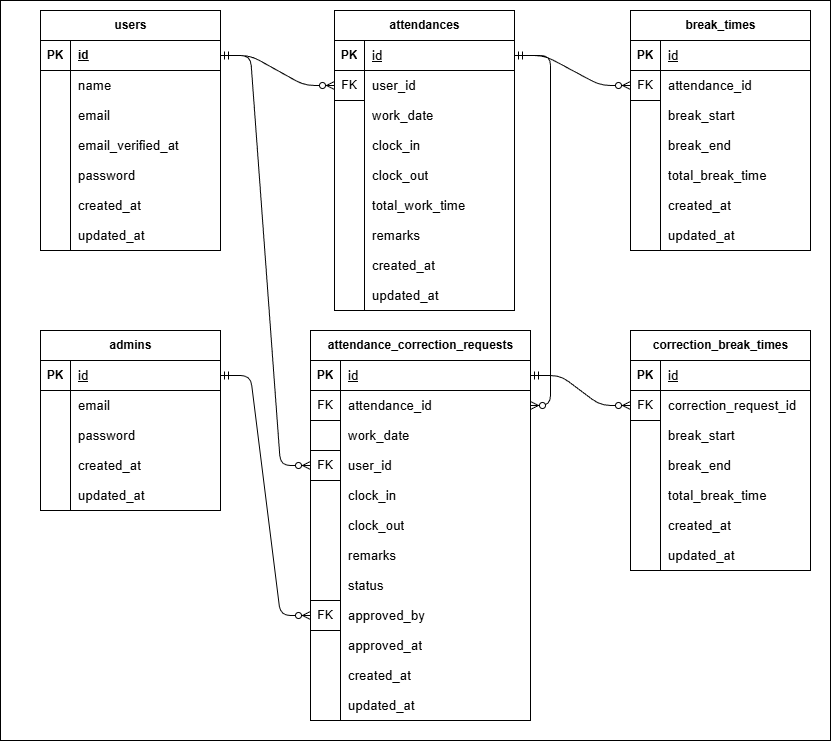
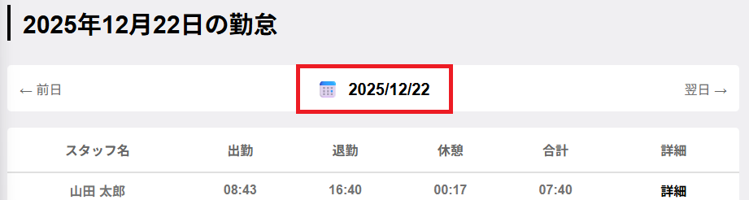
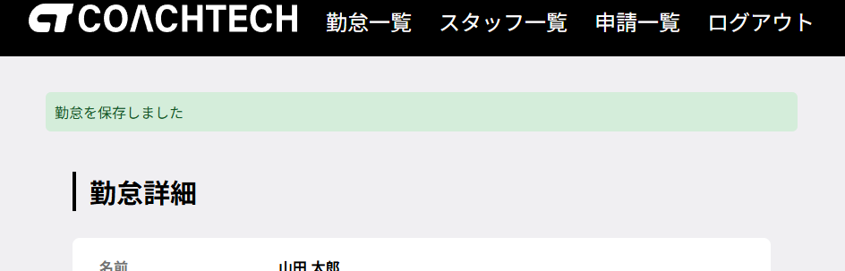

# 勤怠管理アプリ

## 環境構築

### Docker ビルド

1. リポジトリをクローン

```bash
git clone https://github.com/tashima-git/Attendance-app

```

2. Docker Desktop アプリを起動

3. Docker コンテナをビルドして起動

```bash
docker-compose up -d --build
```

### Laravel 環境構築

1. PHP コンテナに入る

```bash
docker-compose exec php bash
```

2. Composer で依存パッケージをインストール

```bash
composer install
```

3. `.env.example` をコピーして `.env` を作成

```bash
cp .env.example .env
```

4. `.env` に以下の環境変数を設定

```dotenv
DB_CONNECTION=mysql
DB_HOST=mysql
DB_PORT=3306
DB_DATABASE=attendance
DB_USERNAME=laravel
DB_PASSWORD=laravel


MAIL_MAILER=smtp
MAIL_HOST=mailhog
MAIL_PORT=1025
MAIL_USERNAME=null
MAIL_PASSWORD=null
MAIL_ENCRYPTION=null
MAIL_FROM_ADDRESS=no-reply@example.com
MAIL_FROM_NAME="Attendance App"
```

5. アプリケーションキーを作成

```bash
php artisan key:generate
```

6. マイグレーションを実行

```bash
php artisan migrate
```

7. シーディングを実行

```bash
php artisan db:seed
```

### テスト環境構築

1. PHP コンテナ内のまま`.env` をコピーして `.env.testing` を作成

```bash
cp .env .env.testing
```

2. `.env.testing` に以下の環境変数を設定

```dotenv
DB_CONNECTION=sqlite
DB_DATABASE=/tmp/database.sqlite
DB_PORT=3306
DB_DATABASE=attendance
DB_USERNAME=laravel
DB_PASSWORD=laravel

MAIL_MAILER=smtp
MAIL_HOST=mailpit
MAIL_PORT=1025
MAIL_USERNAME=null
MAIL_PASSWORD=null
MAIL_ENCRYPTION=null
MAIL_FROM_ADDRESS="hello@example.com"
MAIL_FROM_NAME="${APP_NAME}"
```

3. テスト用ファイルを作成する（初回のみ）
```bash
touch database/testing.sqlite
```

4. テストを実行する

```bash
php artisan test
```

## 使用技術・実行環境

- PHP: 8.2.30
- Laravel: 12.37.0
- MySQL 8.0.44
- Docker / Docker Compose
- Mailhog (メール送信テスト用)

## ER 図



## URL

- 開発環境  
  一般ユーザーログイン画面: [http://localhost/](http://localhost/)  
  &emsp;テスト用一般ユーザー（テスト太郎）ログイン  
  &emsp;&emsp;メールアドレス：test@mail.com  
  &emsp;&emsp;パスワード：00000000  
  (※初回のみメール認証画面に遷移します。再送ボタンを押してから認証画面に遷移して下さい。)  

  管理者ログイン画面: [http://localhost/admin/login](http://localhost/admin/login)  
  &emsp;管理者用ログイン  
  &emsp;&emsp;メールアドレス：admin@mail.com  
  &emsp;&emsp;パスワード：00000000  
  
- phpMyAdmin: [http://localhost:8080/](http://localhost:8080/)

## 補足事項

- SQLite を用いたテストを行っています。
- メール認証は Mailhog を使用しています。
- コーチと相談し利便性を高めるために勤怠一覧画面（一般ユーザー）・スタッフ別勤怠一覧画面（管理者）ではJavaScriptを用いた対象年月日選択機能を実装しています（下記画像赤線部）

- 勤怠詳細画面（管理者）で勤怠修正した場合に画面上部に完了メッセージが表示されます。

